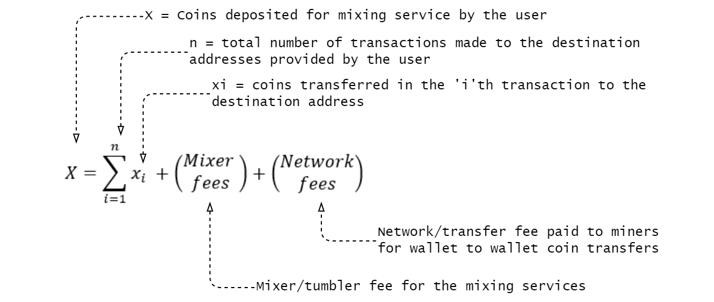
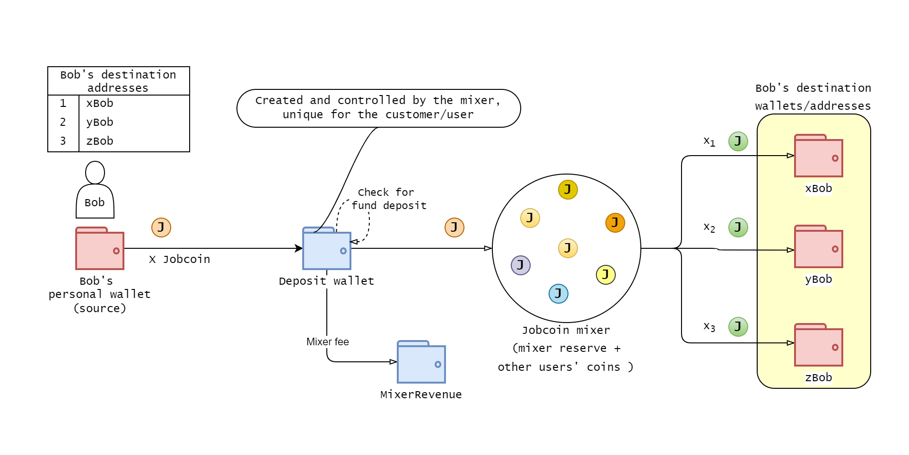
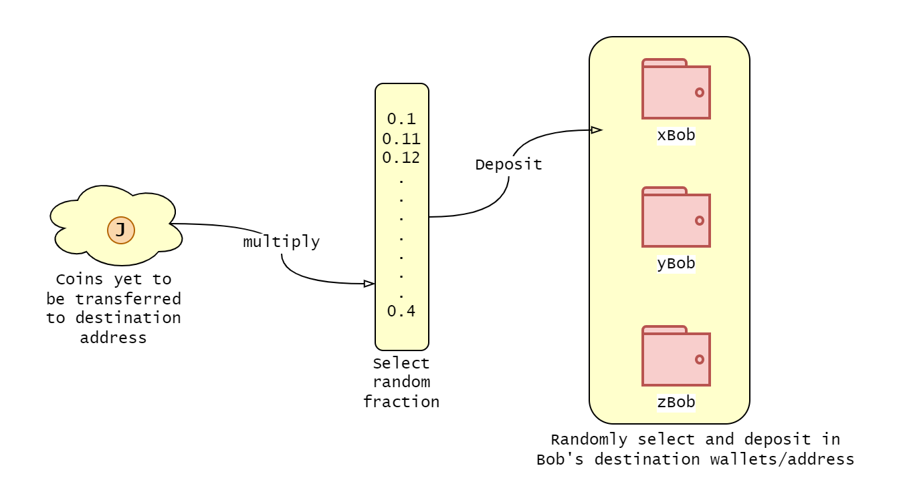
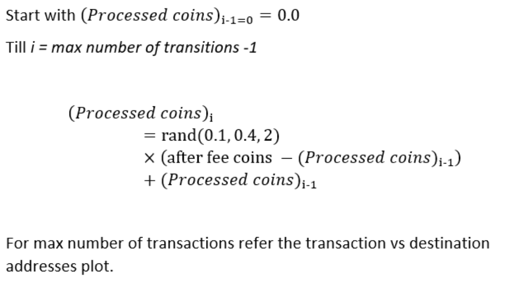
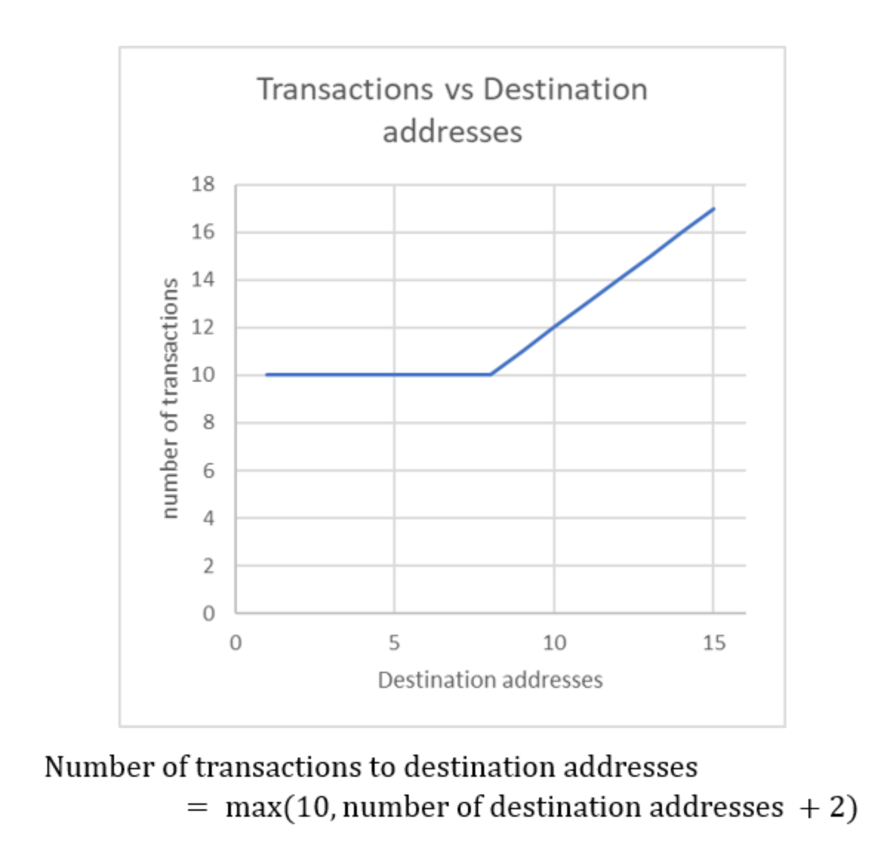

# Coin Mixer  

This is a crypto mixer (here implemented for a fictitious token, Jobcoin) written in Python, using Django framework with Celery and Postgres. 

## Workflow

This mixer provides an API to POST a list of addresses to the mixer and receives a unique address back to deposit the coins. Once the user deposits funds into the deposit address, the coins are transferred to the house wallet. At this step proportional mixer fee is deducted from the deposited coins. This fee is added to a separate mixer revenue wallet. This mixer fee is kept aside for better record keeping of mixer revenue and tax purposes. Along with the mixer fee, there will be transaction/miner fee for on-chain wallet-to-wallet transfers. I have shown it in the following equation but it is not implemented in this version of the code. 

     

Once user coins are deposited in the house wallet the celery task runs every 10 seconds (here I have selected 10 s for easy demonstration but this time could be randomized or could also be dependent on user input). Here I also assume that Jobcoin transfers are instantaneous but, for a given blockchain, celery run time => blocktime.  



The celery task distributes a random fraction of the deposited coin to a user provided random destination per task run.   



As explained in the following for loop, the processed coin variable gets updated after each task.



This mixer has a minimum limit for number of transactions to the destination addresses. This is done to provide a better mixing service in case a small number of destination wallets are provided by the user. However, if the user provides a large number of destination wallets the number of transactions increases with it. In this case, the minimum transations are assumed to be 10 and for distribution wallets > 8 the transaction number is number of destination wallets + 2. This function can easily updated with a new logic.   



Above framework is designed to be fairly flexible and the logic in the mixer is could be modified as needed. 

## Prerequisites:
- Docker
- Docker compose

This repository contains 2 services:
- **Backend:** Mixer API written using Django REST Framework.  It contains a celery task that runs periodically to deposit funds in the destinations.
- **DB:** Postgres database to store deposit, destination and transaction information

## Environment

| Commands             |      Description                       |
|----------------------|----------------------------------------|
| docker-compose build | build the docker images                |
| docker-compose up    | to start the environment in foreground |
| docker-compose down  | to stop the environment                |
 
## Testing:

To run the test cases, bash into docker container and run `./manage.py runserver`

```
~$ docker exec -it  jobcoin-mixer_backend_1 bash
r
root@d261b10f8953:/backend# ./manage.py test
Creating test database for alias 'default'...
System check identified no issues (0 silenced).
...
----------------------------------------------------------------------
Ran 3 tests in 0.019s

OK
Destroying test database for alias 'default'...
root@d261b10f8953:/backend# 
```

## API

Endpoint: `http://localhost:8000/api/mixer/address/`   
Allowed method: POST   
Returns: unique deposit address   
**Example**   
```
curl -i -X POST http://localhost:8000/api/mixer/address/ -H "Content-Type: application/json" -d '{"addresses": ["KS1", "KS2"] }'
```
